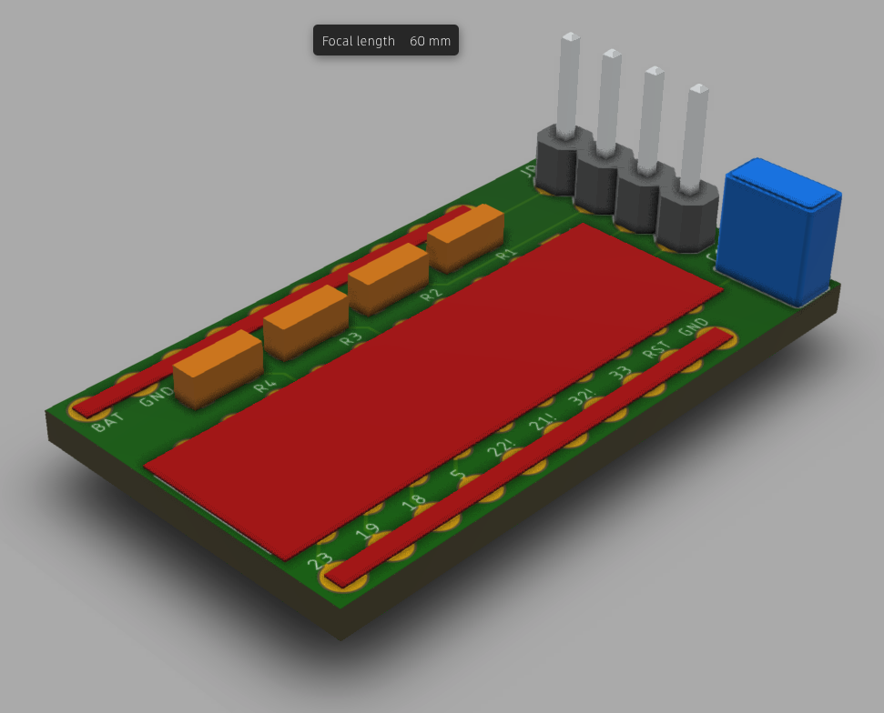
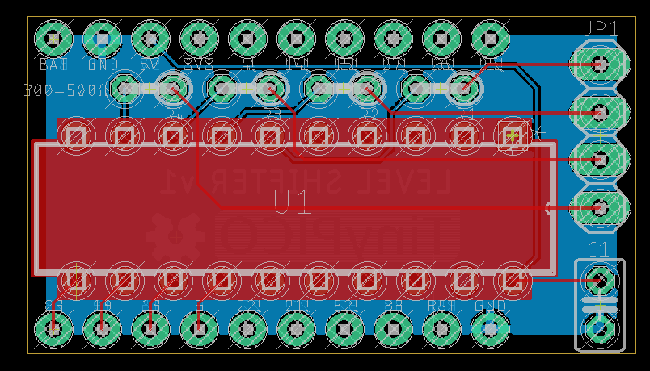
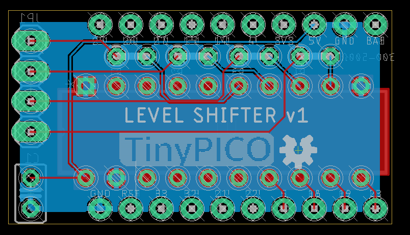
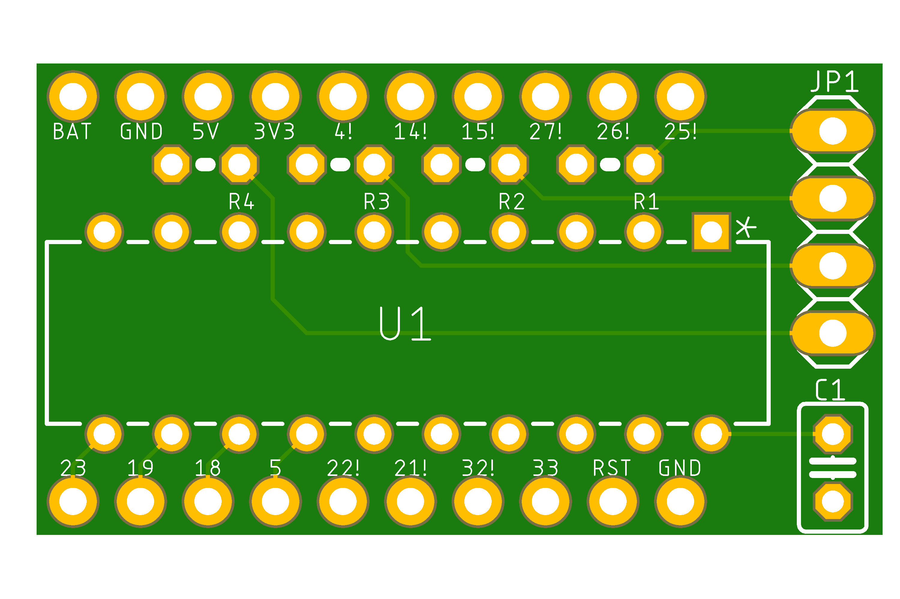
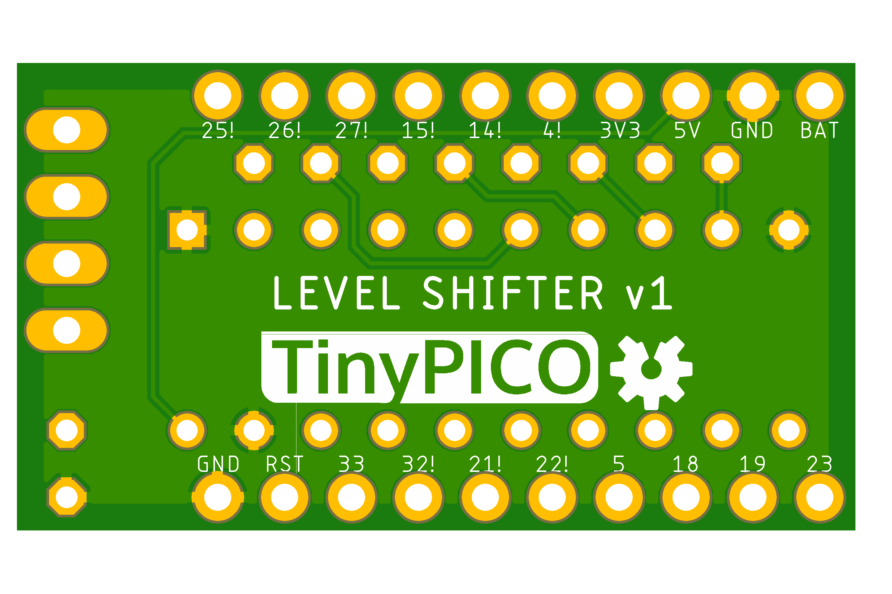

# PCBs

NOTE: Unless otherwise specified, **all of these boards are UNTESTED**!

## TODO
* ESP32 with onboard level shifting
* DoubleWing Color Screen with buttons

## Adafruit DoubleWing INA219x4 (quad) Ammeter
Hopefully similar to Adafruit's INA219 FeatherWing (https://www.adafruit.com/product/3650)

## Adafruit FeatherWing INA219x2 (dual) Ammeter
...

## TinyPICO INA219 Ammeter
Hopefully similar to Adafruit's INA219 FeatherWing (https://www.adafruit.com/product/3650)

## TinyPICO 74HCT245 Level Shifter
* NOTE1: This version is DIP (through-hole) and big; I will be working on a SOIC (surface-mount) version that should be much prettier.
* NOTE2: I plan to use this with the TinyPICO Play Shield, which uses many IO pins, and I don't plan to use SPI, so I am using the SPI pins as GPIO.
* NOTE3: I only need 4 levels shifted, so I am only using 4 of 8 shifters; if you need more, especially if you aren't using the Play Shield, feel free to fork and edit the file for your specific needs.

